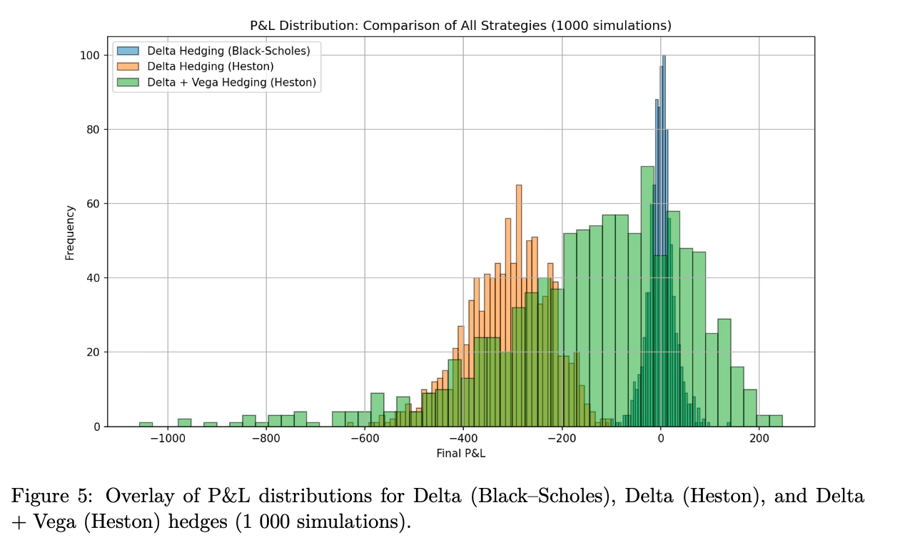
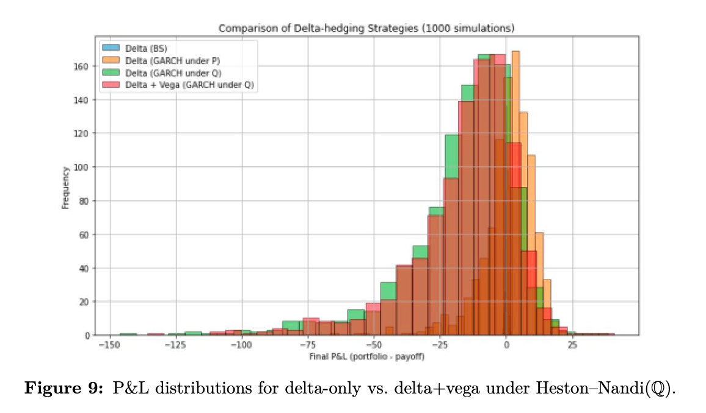

# Volatility Hedging under Stochastic Volatility: Heston & GARCH

This project simulates and compares hedging strategies under two popular stochastic volatility frameworks: **Heston** and **GARCH(1,1)** models. The aim is to evaluate and visualize hedging effectiveness through simulated P&L distributions using delta and vega hedging techniques.

---

## Objectives

- Simulate asset price paths under the Heston and GARCH(1,1) models.
- Implement delta and vega hedging strategies for European options.
- Compare hedging performance using key risk metrics: **mean P&L**, **volatility**, and **standard error**.
- Visualize P&L distributions for each strategy.

---

## Methodology

### 1. Heston Model
- Mean-reverting stochastic volatility.
- Correlated Brownian motions for asset and variance.
- P&L analyzed under:
  - Delta hedging
  - Delta + Vega hedging

### 2. GARCH(1,1) Model
- Discrete-time volatility clustering.
- Simulation of both **under P** and **under Q** measures.
- P&L distributions compared for:
  - Delta (P & Q)
  - Delta + Vega (Q)

### 3. Risk Metrics
- Computed for each strategy over 1000 simulations:
  - Mean
  - Standard deviation
  - Standard error

---

## Visual Output

### Heston:

> Delta vs. Vega+Delta under Heston

### GARCH:

> Delta and Delta+Vega under GARCH

---

## Technologies

- Python
- NumPy / Pandas / Matplotlib
- SciPy (Black-Scholes Greeks)
- Simulation-based P&L backtesting

---

## File Structure

```
├── Final_GARCH_Heston.py   # Cleaned and modular simulation code
├── README.md               # Project documentation
├── Heston.png              # Histogram for Heston strategies
├── Garch.png               # GARCH distribution
```

---

## Author

Basile M'Couela  
EDHEC – MSc Financial Engineering  
Université Côte d’Azur – MSc Applied Mathematics
